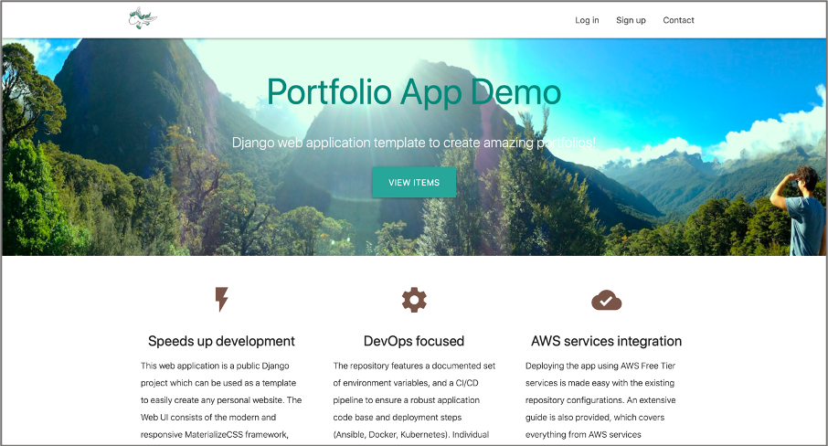

[](https://travis-ci.com/gbourniq/portfolio)

A demo of the web app can be viewed at https://gbournique.com

## Repository overview
This repository features of the following:
- Django web application which can be used as a template for a personal portfolio
- Environment set up steps with Conda, Poetry, and Makefile
- Integration features with AWS S3 to serve application files and backup Postgres data
- CI/CD pipeline with Travis CI and Ansible
- [Extensive instructions](https://portfoliogb.s3.eu-west-2.amazonaws.com/documentation/ec2_deployment_guide.html) to deploy the containerized app on AWS Free Tier services


## Contents
- [Portfolio App Overview](#portfolio-app-overview)
- [Repository Setup](#repository-setup)
- [Local Development](#local-development)
- [RESTful APIs](#restful-apis)
- [Docker Deployment](#docker-deployment)
- [Kubernetes Deployment](#kubernetes-deployment)
- [CI/CD Pipeline](#ci-cd-pipeline)
- [Appendix: Environment variables](#appendix-environment-variables)

## Portfolio App Overview
The web application is using Django for the backend, and the frontend is based on the [Materialize CSS](https://materializecss.com) framework. 

The portfolio app is a simple website that may be utilised to showcase any sort of items (articles, medias, etc.), conveniently grouped into categories. A User registration system is implemented so that users may receive notifications when new content is added to the website.

* App Homepage



* Select Category


* View Items


* Items and Contact Us pages (Mobile view)

    

* Register and Login pages (Mobile view)

    

* Django admin page to manage website content (`/admin`) and [django-tinymce](https://pypi.org/project/django-tinymce4-lite/) widget to insert formatted text and media files

    


## Repository Setup

Prerequisites:
- Install [Miniconda](https://docs.conda.io/en/latest/miniconda.html) 
- Install [Poetry](https://github.com/sdispater/poetry)
- Install [Make](https://www.gnu.org/software/make/)

Clone the repository and cd into the root directory:
```bash
git clone https://github.com/gbourniq/portfolio.git
cd portfolio
```

### 1. Creating the virtual environment

To make things easy, we have added this to the Makefile, so you can create the conda environment and install the dependencies by simply running:

```bash
source .dev.env
make env
```
> Note: the environment can be rebuilt using the same command.

Activate the environment and source the dev environment variables:
```bash
conda activate portfolio
source .dev.env
```

### 2. Set up git hooks
A [pre-commit](https://pypi.org/project/pre-commit/) package is used to manage git hooks. The hooks are defined in `.pre-commit-config.yaml`, and allows to automatically format the code with `autoflake`, `isort` and `black`. To set them up, run:
```bash
make pre-commit
```
> Note: The code can be manually linted with `make lint`


### 3. Install Postgres

If it is not already installed, install [Postgres](https://www.postgresql.org/download/).
After installation, you may need to change some of the postgres configuration to open it up to allow connections from your services.

You can find the path to your postgres config files by running:

```bash
ps aux | grep 'postgres *-D'
```

### 4. Create portfoliodb database
Open a postgres shell as the root user:
```sql
psql
```
In the psql shell execute the following commands:
```sql
CREATE USER portfoliodb PASSWORD 'portfoliodb';
CREATE DATABASE portfoliodb;
GRANT ALL PRIVILEGES ON ALL TABLES IN SCHEMA public TO portfoliodb;
ALTER ROLE portfoliodb IN DATABASE portfoliodb SET search_path = portfoliodb,public;
```

### 5. Environment variables overview
Environment variables are defined in two files: `deployment/.env` and `.dev.env`.

`deployment/.env` contains variables required exclusively for deployment (*prod build*), and `.dev.env` adds variables "on top", used for used development and the ci/cd pipeline (*dev build*).

> Note that sourcing `.dev.env` will automatically source `deployment/.env`, and run a validation script `scripts/env_validation.sh`.


For example, a warning message will be displayed if `AWS_ACCESS_KEY_ID`/`AWS_SECRET_ACCESS_KEY` are missing, while `AWS_ENABLED` is set to `True`.

Environment variables can be edited to customise the dev/uat/prod experience such as:
- Running app with either baremetal django server or docker-compose services (postgres, redis, celery)
- Building a custom app image and publishing to your online repository
- Enabling AWS S3 to store and serve Django media/static files
- Enabling AWS S3 to store artefacts such as Postgres dumps and docker deployment tarballs
- Enabling Ansible to automated the deployment on AWS EC2

All environment variables are listed with a short description, in the [Appendix](#appendix-environment-variables).


## Local Development

### Running the server locally without external docker services

1. If not already active, activate the `portfolio` conda environment:
```bash
conda activate portfolio
```

2. Source environment variables for `dev` build:
```bash
cd portfolio/  # if not already at the root of the repository.
source .dev.env
cd app/
```
> TIP: `autoenv` can be used to automate the activation of environments

3. Create the django superuser required to access the `/admin` page:
```bash
python manage.py createsuperuser
```

4. Apply Django model migrations:
```bash
python manage.py makemigrations
python manage.py makemigrations main
python manage.py migrate
```
> Optional: See that `main_category` main `main_item` tables have been created with `psql portfoliodb` and `\d`.

5. Run the Django server locally:
```bash
python manage.py runserver
```

### Wipe local Postgres database
If you want to wipe the database for whatever reason, run:
```bash
dropdb portfoliodb
createdb portfolio
```

Alternatively, we have a script to recreate a fresh database, apply migrations and create a default Django admin superuser:
```bash
make recreatedb
```

### Testing
Unit-tests and integration tests are run with `pytest-django` to cover the following:
* Simulate requests and insert test data from HTTP-level request handling
* Form validation and processing
* Template rendering

There are ~90 tests which cover ~95% of the application code, which can be run with:
```
make tests
```

**Note:** The tests will require the app to read/write to a Postgres test database. Therefore tests can be run in two different ways:
* Locally: `cd app && pytest .`
* Inside containers, from the root directory, `make tests`


### Versioning
The application versioning is based on the [Semantic Versioning 2.0.0](https://semver.org): <major.minor.patch>.  The version can be found in `pyproject.toml` and can be incremented with `poetry version {bump rule}`.
Valid bump rules are:
1. patch
2. minor
3. major
4. prepatch
5. preminor
6. premajor
7. prerelease

### Build and publish Docker image

1. Set the image name in `deployment/.env`:
```
export IMAGE_REPOSITORY=<your-image-name>
```

2. To build the image, run the following command from the `/portfolio` root directory:
```bash
make image-latest
```
> Note the app version can be used as the image tag with the `make image-tagged` command.

The `make image-*` commands will generate the `portfolio.tar.gz` tarball inside `/bin`:
```
bin/portfolio.tar.gz
├── app
│   ├── main
│   ├── manage.py
│   ├── portfolio
│   ├── static
│   └── static_settings.py
└── scripts
    ├── check_services_health.sh
    ├── env_validation.sh
    ├── postgres_dump_to_s3.sh
    ├── postgres_restore_from_s3.sh
    └── reset_local_db.sh
```
This tarball contains the application code mounted in the docker image.

> The image can be published using either `make publish-latest` or `make publish-tagged`.


## RESTful APIs

Web APIs have been developed using the [Django REST framework](https://www.django-rest-framework.org).

* Browse Category and Item model objects (`ListAPIView`):
```
api/v1/categories/
api/v1/categories/<id>/stats
api/v1/items/
```

* Add new Category and Item model objects (`CreateAPIView`) :
```
api/v1/categories/new
api/v1/items/new
```

* Edit and delete existing Category and Item model objects (`RetrieveUpdateDestroyAPIView`):
```
api/v1/categories/<id>/
api/v1/items/<id>/
```

> Note: Adding and editing objects requires to be logged in.


## Docker Deployment

### Docker Services Architecture
The application is composed of the following docker containers:
- `Nginx` as a reverse proxy (*prod build* only)
- `Django web server` (*dev/prod* build)
- `Celery worker` for asynchronous tasks (*dev/prod* build)
- `Redis` as a message broker and caching (*dev/prod* build)
- `Postgres` to store web server data (*dev/prod* build)

These services are defined in `deployment/docker-deployment/*.docker-compose.yaml` files.

### Running the webserver with docker services (*dev build*)

To start the docker-services, run:
```bash
make up
```
This django webserver will be running at `localhost:8080`

> Note: To run the application using docker, run `export BUILD=prod` in your terminal.

To check that all services are up and healthy, run:
```bash
make check-services-health
```

Postgres backup scripts can then be tested with the following command:
```bash
make postgres-backup-test
```
This will dump the Postgres data from the running container to S3, and restore the latest dump from S3.

For the above command to succeed, the following variables must be set:
- `AWS_ENABLE` set to `True`
- `AWS_ACCESS_KEY_ID` and `AWS_SECRET_ACCESS_KEY`
- `AWS_STORAGE_BUCKET_NAME` and `AWS_DEFAULT_REGION`

> Note: Instructions to set AWS S3 can be found in the [ec2 docker deployment guide](https://portfoliogb.s3.eu-west-2.amazonaws.com/documentation/ec2_deployment_guide.html) 


To stop and remove docker services, run:
```bash
make down
```

### Build the docker deployment artefact

To easily deploy the application to a new instance, one can generate a compressed folder (.tar.gz) containing exclusively the deployment files:
```
bin/docker_deploy.tar.gz
├── deployment
│   ├── .env
│   ├── Makefile
│   └── docker-deployment
│       ├── app
│       │   ├── prod.startup_server.sh
│       │   └── startup_celery.sh
│       ├── nginx
│       │   ├── certs
│       │   │   ├── cert_chain.crt
│       │   │   └── www_gbournique_com.key
│       │   └── conf.d
│       │       └── nginx.conf
│       ├── postgres
│       │   ├── config
│       │   │   └── postgres.conf
│       │   └── docker-entrypoint-initdb.d
│       │       └── run_db_setup.sh
│       ├── redis
│       │   └── redis_healthcheck.sh
│       └── prod.docker-compose.yml
└── scripts
    ├── check_services_health.sh
    ├── env_validation.sh
    ├── postgres_dump_to_s3.sh
    └── postgres_restore_from_s3.sh
```

This compressed archive is referred as the `docker deploy tarball`, and can be generated by running:
```bash
make docker-deploy-tarball-custom
```

> Note: The above command will also upload the tarball to S3, given that AWS credentials and S3 environment variables are configured.

### Running the server with docker services (prod)

The production deployment adds the `nginx` service as a reverse proxy (*prod build*), and run the django webserver using `gunicorn`.

To test the production deployment locally, run the following commands from the `deployment/`:
```bash
cd deployment
source .env
make up
```
The *prod build* deployment will expose incoming traffic is managed by nginx (80/443).

Extensive instruction to deploy the app on AWS can be found in the <DEPLOYMENT> documentation.

> Note: Instructions to deploy the app on AWS can be found from the [ec2 docker deployment guide](https://portfoliogb.s3.eu-west-2.amazonaws.com/documentation/ec2_deployment_guide.html) 


## Kubernetes Deployment

The Kubernetes deployment of the application is managed via a Helm Chart `portfolio-app`. 

Deployments can be easily configured via the `deployment/kubernetes/portfolio-app/values.yaml` file, for e.g, to increase the number of celery worker pods available across the Kubernetes cluster.

By default, the Portfolio app deployment consist of the following Pods:
- Django webserver (x1)
- Celery workers (x2)
- Postgres (x1)
- Redis (x1)

### Prerequisites:
- Install [Minikube](https://kubernetes.io/docs/tasks/tools/install-minikube/) to run a single-node Kubernetes cluster on your machine
- Install [Kubectl](https://kubernetes.io/docs/tasks/tools/install-kubectl/) to run commands against the Kubernetes cluster
- Install the [Helm](https://helm.sh/docs/intro/install/) package manager to deploy our application

### Kubernetes commands
To easily manage our Kubernetes application via the `portfolio-app` Chart, the following make commands are available from the project root directory:

Examine the chart for possible issues, and verify that the chart is well-formed:
```
make helm-lint
```

Run Helm tests for a release to ensure the application works as expected:
```
make helm-test
```

Deploy a release of the chart:
```
make helm-deploy
```

Generate Kubernetes yaml files from the chart templates:
```
make helm-generate-k8s-files
```


## CI-CD Pipeline

In order to faciliate testing, build, and deployment tasks, a CI/CD workflow has been implemented, and can be triggered on Travis CI.


> Note: Any error such a linting error or failed tests will abort the pipeline.


### CI Pipeline

The CI pipeline can triggered locally from the `portfolio/` project root directory:
```bash
make run-ci-pipeline
```
This will run the following steps:
1. Create (or re-create) the conda environment, and install app/dev dependencies from `poetry.lock`
2. Lint application code with `autoflake`, `isort` and `black`
3. Run unit-tests with pytest


### CD Pipeline

Similarly, the CD pipeline can be manually triggered by running:
```bash
make run-cd-pipeline
```
This will run the following steps:
1. Package application code into /bin/portfolio.tar.gz and build docker image
2. Start docker services without nginx (*dev build*)
3. Wait until all services are up and healthy
4. Test postgres backup scripts (if S3 variables are configured): Dump and restore pgdata to/from S3
5. Stop and remove docker services (*dev build*)
6. Publish docker portfolio app image (latest) to the online repository
7. Create docker deploy tarball, and upload to S3 (if S3 variables are configured)
8. Run Ansible playbook for an automated *prod build* deployment on AWS EC2 (if `RUN_ANSIBLE_PLAYBOOK=True`) 


### Ansible

The final step of the CD pipeline is an Ansible playbook to ensure a smooth deployment to fresh EC2 instances. More details on the playbook can be found in the [Ansible playbook documentation](./ansible/README.md).

### Travis

A [Travis CI](https://travis-ci.org) free account can configured to trigger the CI/CD pipeline on every push to a `Github` repository.

The Travis CI build configuration file `.travis.yml` defines the following steps:
1. Install Docker / docker-compose
2. Install Miniconda
3. Install dependencies: make, sshpass
4. Run CI/CD pipeline with `make run-ci-cd-pipeline`

> Note that the following environment variables must be set in the Travis CI settings at https://travis-ci.com.


## Appendix: Environment variables

### Secret Environment variables:

The following sensitive variables must be defined on host (locally in your `~/.bash_profile`, and on Travis CI):

|**Name**                      |**Description**                                                               |
|------------------------------|------------------------------------------------------------------------------|
|`ANSIBLE_VAULT_PASSWORD`      | Passphrase used to encrypt/decrypt secret variables (see /ansible/README.md) |
|`AWS_ACCESS_KEY_ID`           | Programmatic access for AWS EC2 and S3 (see ec2_deployment_guide.html)       |
|`AWS_SECRET_ACCESS_KEY`       | Programmatic access for AWS EC2 and S3 (see ec2_deployment_guide.html)       |
|`DOCKER_USER`                 | Docker username to publish and pull portfolio app image                      |
|`DOCKER_PASSWORD`             | Docker password to publish and pull portfolio app image                      |
|`EMAIL_HOST_USER`             | Email addr. for web admin to receive user messages and notifications (Opt.)  |
|`EMAIL_HOST_PASSWORD`         | Email address password (Optional)                                            |


### Environment variables for deployment (*prod build*)

Main variables in `deployment/.env`:
* Secret variables that must be defined on host
* Django settings for *prod build*
* AWS variables to use Postgres backup scripts and serve django static/media files with S3
* Docker variables for publishing/pulling app image

|**Name**                      |**Description**                                                               |
|------------------------------|------------------------------------------------------------------------------|
|`AWS_ENABLED`                 | Must be set to `False` if AWS S3 is not used                                 |
|`AWS_DEFAULT_REGION`          | Region associated with the S3 bucket. eg. eu-west-2                          |
|`AWS_STORAGE_BUCKET_NAME`     | S3 bucket storing PG backups, django files, and docker deploy tarballs       |
|`BUILD`                       | Used by deployment scripts and ci-cd pipeline. Must be set to `prod`         |
|`DJANGO_SETTINGS_MODULE`      | Path to Django settings module. `prod` -> portfolio.settings.docker_settings |
|`IMAGE_REPOSITORY`            | Docker repository for the portfolio app image                                |
|`POSTGRES_*`                  | Variables for Django app container to connect to Postgres container          |
|`REDIS_*`                     | Variables for Django app container to connect to the Redis container         |
|`SECRET_KEY`                  | For a particular Django installation to provide cryptographic signing        |


### Environment variables for development (*dev build*)

Main variables in `.dev.env`:
* Secret variables that must be defined on host
* General settings
* Django settings for *dev build*
* AWS S3 variables to upload docker deployment tarball
* Ansible variables (Not used if `RUN_ANSIBLE_PLAYBOOK=False`)


|**Name**                      |**Description**                                                               |
|------------------------------|------------------------------------------------------------------------------|
|`ANSIBLE_INSTANCE_ID`         | To start and stop AWS EC2 instance                                           |
|`ANSIBLE_HOST_IP`             | Used in Ansible `inventories` to specify ansible_host                        |
|`ANSIBLE_HOST_NAME`           | Used by docker-compose up role to check if app returns 200                   |
|`ANSIBLE_HOST_PUBLIC_DNS`     | To start and stop AWS EC2 instance                                           |
|`BUILD`                       | Used by deployment scripts and ci-cd pipeline. Must be set to `dev`          |
|`CONDA_ENV_NAME`              | Name of the conda environment. `portfolio` is the default name               |
|`DJANGO_SETTINGS_MODULE`      | Path to Django settings module. `dev` -> portfolio.settings.local_settings   |
|`DOCKER_DEPLOY_FOLDER`        | Folder in `AWS_STORAGE_BUCKET_NAME` to store docker deploy tarballs          |
|`PORTFOLIO_ROOT_DIR`          | For ansible roles to navigate on the remote and run commands                 |
|`QA_INSTANCE_TIME_MINUTES`    | Number of minutes the app should be running before the instance is shut down |
|`RUN_ANSIBLE_PLAYBOOK`        | Set to `False` to skip the Ansible playbook in the CD pipeline               |
|`S3_DOCKER_DEPLOY_CD_PIPELINE`| Basename of docker deployment tarball used by ci/cd pipeline and Ansible     |
|`S3_DOCKER_DEPLOY_CUSTOM`     | Basename of docker deployment tarball used by user to manually deploy app    |
|`SLACK_TOKEN`                 | Token for Ansible to connect to the slack app (Optional)                     |
|`SSL_*_S3_OBJECT_PATH`        | S3 paths for SSL private key and certificate (required for nginx)            |
|`SSL_*_HOST_PATH`             | EC2 host path where SSL private key and certificate are located              |

